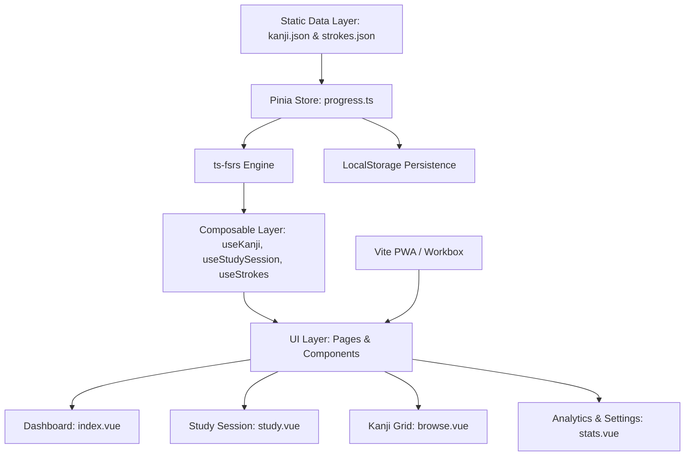

# Kanji SRS — Comprehensive Architecture & Technical Documentation

Welcome to the technical documentation hub for **Kanji SRS**, a local-first spaced-repetition study application for JLPT N5 kanji built with Nuxt 4, Tailwind CSS v4, `ts-fsrs`, and SVG stroke order animations.

---

## 🗺️ Documentation Sitemap

| Specification & Design                                    | Implementation Phases                                    | Architecture Decisions (ADRs)                                                      |
| --------------------------------------------------------- | -------------------------------------------------------- | ---------------------------------------------------------------------------------- |
| 📄 [SPEC.md](SPEC.md) — Product specification & goals     | 🚀 [PHASE1.md](PHASE1.md) — Data layer & FSRS engine     | 🏛️ [ADR-0001](adr/0001-use-fsrs-over-sm2.md) — FSRS over SM-2                      |
| 🎨 [DESIGN.md](DESIGN.md) — Design system & color tokens  | 📱 [PHASE2.md](PHASE2.md) — Study UI, navigation & views | 🏛️ [ADR-0002](adr/0002-localstorage-over-indexeddb.md) — LocalStorage vs IndexedDB |
| 🗄️ [DATA-MODEL.md](DATA-MODEL.md) — Card & review schemas | 🖋️ [PHASE3.md](PHASE3.md) — Animated SVG stroke order    | 🏛️ [ADR-0003](adr/0003-build-time-json-over-runtime-parsing.md) — Build-time JSON  |
| 🛠️ [SETUP.md](SETUP.md) — Local development & tooling     | 📶 [PHASE4.md](PHASE4.md) — PWA, offline & E2E testing   | 🏛️ [ADR-0004](adr/0004-n5-kanji-list-source.md) — N5 Kanji list source             |

---

## 🏗️ Architecture Overview



---

## 🚀 Key Subsystems

### 1. FSRS Spaced Repetition Engine

- **Engine Library:** Powered by `ts-fsrs`.
- **Target Retention:** Configurable (default `0.90` / 90%).
- **Grade Inputs:** 4 color-coded FSRS grades:
  - `Again (1)` — Reset stability & schedule relearning card
  - `Hard (2)` — Slower interval growth
  - `Good (3)` — Standard FSRS interval calculation
  - `Easy (4)` — Accelerated stability growth
- **Keyboard Shortcuts:** `Space` (Reveal answer), `1` (Again), `2` (Hard), `3` (Good), `4` (Easy).

### 2. Animated Stroke Order (`KanjiStrokeOrder.vue`)

- **Data Source:** Pre-processed ordered SVG path strings (`viewBox: "0 0 109 109"`) for all 103 N5 kanji in `app/data/strokes.json`.
- **Bundle Optimization:** Asynchronously loaded on-demand via `useStrokes()` composable.
- **Controls:** Play/Pause, Step Prev/Next, Replay, and Speed multiplier (0.5x, 1x, 1.5x, 2x).

### 3. PWA & Offline Service Worker

- **PWA Module:** Configured via `@vite-pwa/nuxt`.
- **Service Worker Strategy:** `autoUpdate` mode with Workbox offline fallback caching for static bundles, fonts, and JSON datasets.

---

## 🧪 Quality Assurance & Testing

```bash
# Type-check TypeScript & SFC templates
bun run typecheck

# Run Vitest unit tests (Pinia store & FSRS calculations)
bun run test

# Run Playwright E2E tests (Dashboard, Study flow, Browse search, Stats)
bun run test:e2e

# Run ESLint & Prettier
bun run lint
bun run format
```

---

## 📄 License & Attributions

- **Code:** MIT License.
- **KANJIDIC2:** Kanji dictionary data is property of the Electronic Dictionary Research and Development Group (EDRDG), used under CC BY-SA 3.0.
- **KanjiVG:** Stroke order SVG path data is copyright © Ulrich Apel, used under CC BY-SA 3.0.
