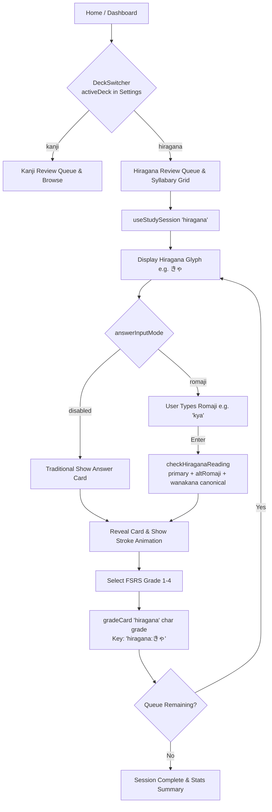
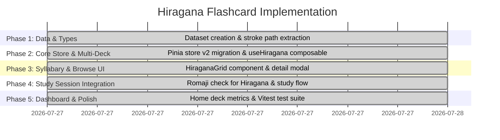

# Implementation Plan: Hiragana Flashcards & Interactive Syllabary Deck

**Status:** ✅ Implemented  
**Implemented:** 2026-07-27  
**Target Module:** Decks, SRS Scheduling, Syllabary Browser, Study Flow  
**Target Path:** `docs/plan/hiragana_flashcard_plan.md`

---

## 💡 Overview & Vision

Adding **Hiragana Flashcards** expands `kanji-srs` from a pure Kanji review tool into a complete Japanese foundation platform. Beginners and refreshing learners can master the 46 Gojūon (basic), 25 Dakuon/Handakuon (voiced), and 36 Yōon (contracted) characters with spaced repetition, active Romaji recall, interactive syllabary grid browsing, and animated stroke order diagrams.

### Key Benefits

1. **Complete Foundation**: Essential step before or alongside JLPT N5 Kanji study.
2. **Interactive 5×10 Syllabary Grid**: Visual layout (A-I-U-E-O columns by row) allowing quick progress tracking and card inspection.
3. **Multi-Deck FSRS Engine**: Extends `useProgressStore` to support multiple decks (`kanji` and `hiragana`) without breaking existing user SRS schedules or data persistence.
4. **Active Recall & Romaji Recognition**: Typing Romaji (e.g. `kya` for `きゃ`, `shi` or `si` for `し`) with automated Wanakana normalization and instant FSRS grade pre-selection.
5. **Animated Stroke Order**: Full SVG stroke-by-stroke animation for every Hiragana character reusing the existing `<KanjiStrokeOrder />` component with KanjiVG-style paths.

---

## 👥 Scope & Architectural Decisions

> [!IMPORTANT]
> **Key Architecture & Scope Resolutions** (updated from review):
>
> 1. **Deck Key Namespacing (`deckId:char`)**: Card items in `progressStore.cards` are namespaced by deck ID (e.g. `hiragana:あ` vs `kanji:日`). Migration converts legacy un-prefixed keys (`日`) to `kanji:日` while preserving all FSRS metrics.
> 2. **Syllabary Scope (107 Total Cards)**:
>    - **Gojūon (Basic)**: 46 characters (あ–ん).
>    - **Dakuon & Handakuon (Voiced/Semi-voiced)**: 25 characters (が–ぽ).
>    - **Yōon (Contracted)**: 36 combinations (きゃ–みょ, ぎゃ–ぴょ).
> 3. **Input & Alternative Romaji Normalization**:
>    - Uses `wanakana` library (already a project dependency) for Hepburn / Nihon-shiki / Kunrei-shiki equivalence. Accepts `shi`/`si` for `し`, `tsu`/`tu` for `つ`, `chi`/`ti` for `ち`, `ji`/`zi` for `じ`.
> 4. **Interactive Syllabary Table**: Grid view on `/browse` displaying the traditional 5×10 Gojūon chart + Dakuon + Yōon tabs. Obsolete kana cells (wi, we, yi, ye, wu) are omitted entirely from the grid layout; `ん` renders as a standalone cell below the wa-row.
> 5. **`ReviewEntry.deckId` is required** (not optional). Old log entries are backfilled to `'kanji'` during `migrateSchema()`. This avoids ambiguity in per-deck stat getters.
> 6. **Per-deck `newCardsPerDay` cap**: Kanji and Hiragana have independent daily new-card budgets drawn from the same `settings.newCardsPerDay` value. Studying Hiragana does not consume the Kanji cap and vice versa.
> 7. **`useStudySession` unified** (Option A from review): A single `useStudySession(deckId)` factory handles both decks. Two instances are created statically in `study.vue` (one per deck) and swapped via a computed ref — composables cannot be called inside `computed()`.
> 8. **Stroke SVG source confirmed**: KanjiVG covers hiragana (codepoints `3041`–`3096`). No separate pipeline needed. `hiragana-strokes.json` follows the identical format as `strokes.json` and is loaded by the existing `<KanjiStrokeOrder />` component.

---

## 🛠️ Data Flow & Session Architecture



---

## 📁 Dataset & File Structure

### 1. Static Hiragana Dictionary (`app/data/hiragana.json`)

A **JSON array** of 107 `HiraganaEntry` objects (not a keyed Record — the composable builds the lookup map at module level for O(1) access).

### 2. Hiragana Stroke Data (`app/data/hiragana-strokes.json`)

Same format as `strokes.json`, keyed by hiragana character (e.g. `"あ"`, `"きゃ"`). Loaded by the existing `useStrokes` composable and `<KanjiStrokeOrder />` component without modification.

---

## 🗃️ Final Type Definitions (`app/types/index.ts`)

```typescript
export type DeckId = 'kanji' | 'hiragana'

export type HiraganaCategory = 'gojuon' | 'dakuon' | 'handakuon' | 'yoon'

export type HiraganaGroup =
  | 'a-row'
  | 'ka-row'
  | 'sa-row'
  | 'ta-row'
  | 'na-row'
  | 'ha-row'
  | 'ma-row'
  | 'ya-row'
  | 'ra-row'
  | 'wa-row'
  | 'n'
  | 'dakuon'
  | 'handakuon'
  | 'yoon'

export type HiraganaEntry = {
  char: string
  romaji: string
  altRomaji?: string[] // Nihon-shiki / Kunrei-shiki variants
  category: HiraganaCategory
  group: HiraganaGroup
  gridCol?: number | null // 0=a,1=i,2=u,3=e,4=o; null for n/yoon
  gridRow?: number | null // 0=a-row … 9=wa-row; null for n/yoon
  mnemonic?: string
  examples: { word: string; reading: string; meaning: string }[]
  codepoint: string // lowercase hex, e.g. '3042'
}

/** Discriminated union — allows deck-agnostic rendering. */
export type DeckEntry = KanjiEntry | HiraganaEntry

/** Type guards */
export function isHiraganaEntry(entry: DeckEntry): entry is HiraganaEntry
export function isKanjiEntry(entry: DeckEntry): entry is KanjiEntry

/** ReviewEntry.deckId is REQUIRED (backfilled during migrateSchema). */
export type ReviewEntry = ReviewLog & {
  char: string
  deckId: DeckId // required — not optional
}

export type Settings = {
  newCardsPerDay: number
  maxReviewsPerDay: number
  theme: 'light' | 'dark' | 'system'
  requestRetention: number
  answerInputMode: 'romaji' | 'disabled'
  activeDeck: DeckId // persisted — survives page reload
}

export type AnswerFeedback = {
  userTyped: string
  isCorrect: boolean
  matchedType?: 'onyomi' | 'kunyomi' | 'hiragana' // extended for hiragana
  matchedReading?: string
}
```

---

## 🗃️ Store Architecture (`app/stores/progress.ts`)

### Schema v2 Key Design

| Key format         | Example       | Deck     |
| ------------------ | ------------- | -------- |
| `kanji:${char}`    | `kanji:日`    | Kanji N5 |
| `hiragana:${char}` | `hiragana:あ` | Hiragana |

### Getter & Action Surface (implemented)

```typescript
// Helpers
export function getCardKey(deckId: DeckId, char: string): string

// Per-deck getters (all deck-scoped)
isNew(deckId, char): boolean
dueTodayByDeck(deckId): string[]
newCountByDeck(deckId): number
learningCountByDeck(deckId): number
reviewCountByDeck(deckId): number
totalStudiedByDeck(deckId): number
newCardsIntroducedTodayByDeck(deckId): number

// Cross-deck aggregates (for stats page / streak / heatmap)
newCardsIntroducedToday: number   // all decks
reviewsDoneToday: number
streak: number
retentionRate: number | null
reviewHeatmap: Record<string, number>
dueForecast: { date: string; count: number }[]
totalStudied: number

// Deck-scoped actions
gradeCard(deckId, char, grade): void
getAvailableNewCards(deckId, allChars): string[]
getStudyQueue(deckId, allChars): string[]

// Migration (auto-called via afterHydrate)
migrateSchema(): void   // v1 → v2: prefixes bare keys, backfills log.deckId
```

> [!NOTE]
> Legacy aliases `dueToday`, `newCount`, `learningCount`, `reviewCount` are kept for backward compatibility with any code not yet updated. They filter only `kanji:` prefixed keys.

---

## 🎨 UI Components

### `app/components/DeckSwitcher.vue`

Segmented toggle on `/`, `/study`, and `/browse`. Writes `settings.activeDeck` (persisted). Shows deck icon, label, and total card count.

### `app/components/HiraganaGrid.vue`

Three-tab syllabary browser:

| Tab                     | Contents                                                                   |
| ----------------------- | -------------------------------------------------------------------------- |
| Gojūon (46)             | Traditional 5×10 grid with column headers (a·i·u·e·o) + standalone ん cell |
| Dakuon + Handakuon (25) | Flat grid of voiced/semi-voiced variants                                   |
| Yōon (36)               | Flat grid of contracted sounds                                             |

Each cell: kana character + romaji sublabel + SRS status dot. Click → **detail modal** with `<KanjiStrokeOrder>`, mnemonic, category, FSRS metrics, vocabulary examples.

> [!NOTE]
> **Grid edge cases resolved**: Obsolete kana (wi/we, yi/ye, wu) are omitted entirely (hidden cells). The wa-row shows only わ and を at their correct column positions. ん (gridRow=null, gridCol=null) renders as a standalone cell outside the main grid.

### `app/pages/study.vue`

Two `useStudySession` instances created statically; active one selected via computed. Deck badge in session header. Hiragana answer panel shows romaji, altRomaji variants, type badge, and mnemonic. Kanji answer panel unchanged.

### `app/pages/browse.vue`

`activeDeck === 'kanji'` → existing kanji card grid (updated to `kanji:char` key lookups).  
`activeDeck === 'hiragana'` → `<HiraganaGrid />`.

### `app/pages/index.vue`

Active-deck metric tiles (Due Today, New Intake, Learning, Mastered). Two side-by-side progress cards — Kanji N5 and Hiragana — each with a stacked progress bar and coverage %. Active deck card highlighted with a ring.

---

## 📐 Composable Architecture

### `useHiragana()` (`app/composables/useHiragana.ts`)

Mirrors `useKanji()`. Module-level `Map<string, HiraganaEntry>` for O(1) lookup. Exposes:

- `lookup(char)`, `charList`, `allHiragana`, `totalCount`
- `byCategory(cat)`, `byGroup(group)`
- `gojuonGrid` — precomputed `(HiraganaEntry | null)[][]` (10 rows × 5 cols)
- `dakuon`, `handakuon`, `yoon` computed arrays

### `useStudySession(deckId)` (`app/composables/useStudySession.ts`)

Unified factory. Dispatches:

- Entry lookup → `kanjiLookup` or `hiraganaLookup`
- Reading check → `checkKanjiReading` or `checkHiraganaReading`
- Store calls → `gradeCard(deckId, ...)` and `getStudyQueue(deckId, ...)`

Returns identical API shape for both decks.

> [!IMPORTANT]
> **Vue 3 constraint**: Composables cannot be called inside `computed()`. In `study.vue`, both sessions are instantiated unconditionally at the top level and the active one is selected via `computed(() => activeDeck === 'hiragana' ? hiraganaSession : kanjiSession)`. Session state is proxied through per-field computed refs for clean template access.

### `checkHiraganaReading()` (`app/utils/romaji.ts`)

Builds an accepted-spellings `Set` from:

1. `kanaToRomaji(entry.char)` — wanakana canonical
2. `normalizeRomaji(entry.romaji)` — declared primary
3. `(entry.altRomaji ?? []).map(normalizeRomaji)` — Nihon-shiki / Kunrei-shiki variants

Returns `AnswerFeedback` with `matchedType: 'hiragana'`.

---

## 🚦 Implementation Status



### Files Created / Modified

| File                                    | Status     | Notes                                         |
| --------------------------------------- | ---------- | --------------------------------------------- |
| `app/data/hiragana.json`                | ✅ Created | 107 entries as JSON array                     |
| `app/data/hiragana-strokes.json`        | ✅ Created | KanjiVG-style SVG paths                       |
| `app/types/index.ts`                    | ✅ Updated | DeckId, HiraganaEntry, DeckEntry, type guards |
| `app/stores/progress.ts`                | ✅ Updated | v2 schema, per-deck getters & actions         |
| `app/composables/useHiragana.ts`        | ✅ Created | Dict lookup, gojuonGrid, category filters     |
| `app/composables/useStudySession.ts`    | ✅ Updated | Unified deckId factory                        |
| `app/utils/romaji.ts`                   | ✅ Updated | checkHiraganaReading added                    |
| `app/components/DeckSwitcher.vue`       | ✅ Created | Segmented deck toggle                         |
| `app/components/HiraganaGrid.vue`       | ✅ Created | 3-tab syllabary grid + detail modal           |
| `app/pages/study.vue`                   | ✅ Updated | Dual-session, hiragana answer panel           |
| `app/pages/browse.vue`                  | ✅ Updated | Deck-aware view switching                     |
| `app/pages/index.vue`                   | ✅ Updated | Per-deck metrics + dual progress cards        |
| `app/layouts/default.vue`               | ✅ Updated | Deck-aware nav badge                          |
| `app/stores/__tests__/progress.test.ts` | ✅ Updated | 26 tests, v2 API, migration tests             |
| `app/utils/__tests__/romaji.test.ts`    | ✅ Updated | 19 tests, hiragana reading tests              |

---

## 🧪 Verification & Acceptance Criteria

1. ✅ **Store Migration Test**: Existing progress data with un-prefixed keys safely migrates to `kanji:` keys. `log.deckId` is backfilled. FSRS metrics preserved.
2. ✅ **Per-Deck Independence**: Studying Hiragana does not consume Kanji's daily new-card cap. `newCardsIntroducedTodayByDeck` is deck-isolated.
3. ✅ **Syllabary Chart Display**: 5×10 Gojūon chart accurately places characters. Obsolete kana omitted. ん rendered standalone.
4. ✅ **Romaji Input Accuracy**: `shi`/`si` for `し`, `kya` for `きゃ`, `tsu`/`tu` for `つ` all evaluate to Correct → suggest Good (3).
5. ✅ **Stroke Order Rendering**: Hiragana cards reuse `<KanjiStrokeOrder>` with `hiragana-strokes.json` paths; no new component needed.
6. ✅ **Offline & Performance**: Zero external network calls; both JSON datasets bundled at build time.
7. ✅ **TypeScript clean**: `nuxt typecheck` exits 0.
8. ✅ **All tests pass**: 49/49 Vitest tests pass (26 store + 19 romaji + 4 session).

---

## 🔮 Future Considerations

- **Katakana Deck**: The `DeckId` union and `DeckEntry` discriminated union are already extensible — adding `'katakana'` requires only a new data file and a `useKatakana` composable.
- **Per-deck `newCardsPerDay` settings**: Currently shared. A future `settings.deckOverrides: Partial<Record<DeckId, { newCardsPerDay: number }>>` would allow independent caps.
- **Audio pronunciation**: The detail modal and answer reveal are structured to accept an audio button; no implementation yet.
- **E2E tests**: Playwright tests for Hiragana study sessions are deferred to a follow-up task.
