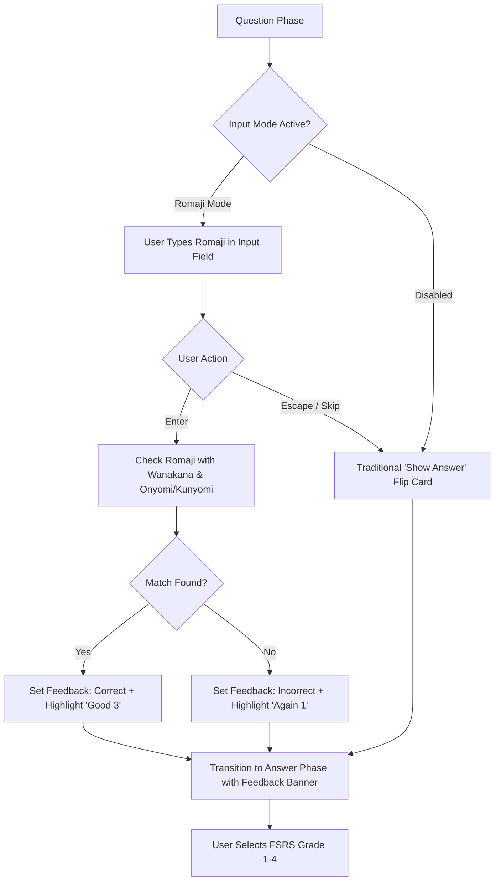

# Implementation Plan: Romaji Text Answer Input for Kanji Flashcards (Final Revision)

Adding text answer input in **Romaji format** enhances the flashcard review process from passive visual recognition to **active recall**. Users type the reading of a Kanji in Romaji before revealing the card, receiving instant correctness feedback and suggested FSRS grades.

---

## 💡 Overview & Benefits

1. **Active Recall**: Forces exact recall of Kanji readings (On'yomi / Kunyomi) in Romaji (e.g. typing `yasui` or `an` for `安`).
2. **Instant Feedback**: Highlights whether the answer was **Correct (Match)** or **Incorrect (Mismatch)** upon pressing `Enter`.
3. **Smart FSRS Grading Assistance**:
   - **Correct**: Automatically pre-selects / highlights **Good (3)**.
   - **Incorrect**: Automatically pre-selects / highlights **Again (1)**.
4. **Flexible & Optional**: Users can press `Escape` or click "Show Answer" to reveal without typing, or toggle the input mode (`romaji` vs `disabled`) on the study screen header (persists automatically to `localStorage`).

---

## 👥 User Review Required & Scope Decisions

> [!IMPORTANT]
> **V1 Scope & Review Resolutions**:
>
> 1. **V1 Mode Scope**: Focused on `'romaji'` reading mode and `'disabled'` (flip card mode). `'meaning'` and `'both'` modes are deferred to Phase 2.
> 2. **Dependency**: Add `wanakana` (`^5.3.1`) as a dependency for robust Kana↔Romaji conversion, handling edge cases like small tsu (`っ`), okurigana, katakana, macrons, and Hepburn/Nihon-shiki variants (e.g. `chi` and `ti`).
> 3. **Keyboard Shortcuts & Skip State**:
>    - `Enter`: Submit answer from text input.
>    - `Escape`: Skip/reveal answer without typing (`lastFeedback` remains `null`, standard answer card shown).
>    - `1`-`4`: Select FSRS rating (active when answer is revealed).
> 4. **State Persistence & Reset**: Header toggle directly updates `progressStore.settings.answerInputMode` (persisted to `localStorage`). Card advancement in `grade()` automatically resets `userAnswer` and `lastFeedback`.

---

## 🛠️ Proposed Changes



---

### Component & Data Model Updates

#### 1. Dependencies (`package.json`)

Add `wanakana` to dependencies.

```bash
bun add wanakana
bun add -D @types/wanakana
```

#### 2. Core Types (`app/types/index.ts`)

Add `answerInputMode` to user `Settings` and define `AnswerFeedback`.

```typescript
export type AnswerInputMode = 'romaji' | 'disabled'

export type Settings = {
  newCardsPerDay: number // default 5
  maxReviewsPerDay: number // default 100
  theme: 'light' | 'dark' | 'system'
  requestRetention: number // default 0.9
  answerInputMode: AnswerInputMode // NEW: default 'romaji'
}

export type AnswerFeedback = {
  userTyped: string
  isCorrect: boolean
  matchedType?: 'onyomi' | 'kunyomi'
  matchedReading?: string
}
```

#### 3. Romaji & Kana Normalization Utility (`[NEW] app/utils/romaji.ts`)

Create `app/utils/romaji.ts` using `wanakana` (Nuxt auto-imports functions in `app/utils/`).

```typescript
import { toRomaji } from 'wanakana'
import type { KanjiEntry, AnswerFeedback } from '~/types'

/**
 * Normalizes Romaji string: lowercases, trims whitespace, strips okurigana dots ('.') and hyphens ('-').
 */
export function normalizeRomaji(str: string): string {
  return str
    .toLowerCase()
    .trim()
    .replace(/[\.\-\s]/g, '')
}

/**
 * Checks whether user input matches any On'yomi or Kun'yomi reading of the Kanji.
 * Handles okurigana variations, case insensitivity, short readings, and romanization variants.
 */
export function checkKanjiReading(input: string, entry: KanjiEntry): AnswerFeedback
```

**Extended Matching Logic Table:**

| Kanji | Reading in Data            | User Input  | Match Result | Reason                                           |
| ----- | -------------------------- | ----------- | ------------ | ------------------------------------------------ |
| `安`  | `kunyomi: ["やす.い"]`     | `yasui`     | ✅ Correct   | Exact full romaji match                          |
| `安`  | `kunyomi: ["やす.い"]`     | `yasu`      | ✅ Correct   | Matches stem before okurigana dot                |
| `安`  | `onyomi: ["アン"]`         | `AN` / `an` | ✅ Correct   | Case insensitive katakana on'yomi match          |
| `一`  | `onyomi: ["イチ", "イツ"]` | `ichi`      | ✅ Correct   | Matches first of multiple on'yomi readings       |
| `日`  | `kunyomi: ["-び"]`         | `bi`        | ✅ Correct   | Hyphen stripped, matches suffix reading          |
| `日`  | `kunyomi: ["ひ"]`          | `hi`        | ✅ Correct   | Single-character reading match                   |
| `一`  | `onyomi: ["イチ"]`         | `iti`       | ✅ Correct   | `wanakana` supports Hepburn/Nihon-shiki variants |
| `安`  | `kunyomi: ["やす.い"]`     | `xyz`       | ❌ Incorrect | No reading match                                 |

#### 4. Study Session Composable (`app/composables/useStudySession.ts`)

Extend `useStudySession` state and actions:

- Add `userAnswer` (`ref('')`) and `lastFeedback` (`ref<AnswerFeedback | null>(null)`).
- Add `submitAnswer(input: string)`:
  - Calls `checkKanjiReading(input, currentEntry.value)`.
  - Stores `lastFeedback`.
  - Sets `phase.value = 'answer'`.
- Update `revealAnswer()`:
  - When invoked directly (or via `Escape`), `lastFeedback.value` stays `null`.
- Update `grade(rating: Grade)`:
  - Resets `userAnswer.value = ''` and `lastFeedback.value = null` when advancing card.

#### 5. Progress Store (`app/stores/progress.ts`)

Update `defaultSettings` in `app/stores/progress.ts`:

```typescript
export const defaultSettings: Settings = {
  newCardsPerDay: 5,
  maxReviewsPerDay: 100,
  theme: 'system',
  requestRetention: 0.9,
  answerInputMode: 'romaji', // NEW
}
```

#### 6. Study Page UI (`app/pages/study.vue`)

Enhance `app/pages/study.vue`:

- **Question Phase (when `answerInputMode === 'romaji'`)**:
  - Focusable text `<input>` with placeholder: `Type Romaji reading (e.g. yasui)...`
  - Keyboard listeners:
    - `Enter`: submit typed answer (`submitAnswer(userAnswer)`).
    - `Escape`: reveal answer without typing (`revealAnswer()`).
  - Action hint bar: `Press Enter to check • Press Esc to skip`.
  - Toggle button in header to switch input mode (`romaji` <-> `disabled`), bound directly to `progressStore.settings.answerInputMode` for instant persistence.
- **Answer Phase**:
  - Feedback Banner at top of revealed card (if `lastFeedback` is not null):
    - 🟢 **Correct!** "You typed `yasui` — Matches Kun'yomi (やす.い)"
    - 🔴 **Incorrect** "You typed `xyz` — Expected readings: `アン (an)`, `やす.い (yasui)`"
  - FSRS Grade buttons visually highlight suggested rating (**Good (3)** for correct, **Again (1)** for incorrect). If skipped (`lastFeedback === null`), no grade is pre-highlighted.

---

## 🧪 Verification Plan

### Automated Tests

1. **Romaji Normalization & Answer Verification Unit Tests** (`[NEW] app/utils/__tests__/romaji.test.ts`):
   - Test Katakana and Hiragana to Romaji normalization (`やす.い` -> `yasui`/`yasu`, `アン` -> `an`).
   - Test okurigana dot and hyphen stripping, case insensitivity, and romanization variants (`iti`/`ichi`).
   - Test `checkKanjiReading` against various `KanjiEntry` samples.
   - Run via: `bun run test`
2. **Study Session Composable Unit Tests**:
   - Verify `submitAnswer` sets correct `lastFeedback` and advances phase.
   - Verify `grade()` clears `userAnswer` and `lastFeedback`.
   - Run via: `bun run test`

### Manual Verification

1. Install `wanakana`: `bun add wanakana && bun add -D @types/wanakana`
2. Start dev server: `bun run dev`
3. Navigate to `/study`:
   - Type Romaji reading for Kanji card (e.g., `an` for `安`) and hit `Enter`.
   - Confirm green success banner and highlighted **Good (3)** button.
   - Type wrong reading (e.g., `xyz`) and hit `Enter`.
   - Confirm red error banner showing expected readings and highlighted **Again (1)** button.
   - Test `Escape` key to skip typing.
   - Test toggling input mode to `disabled` and back in header.
